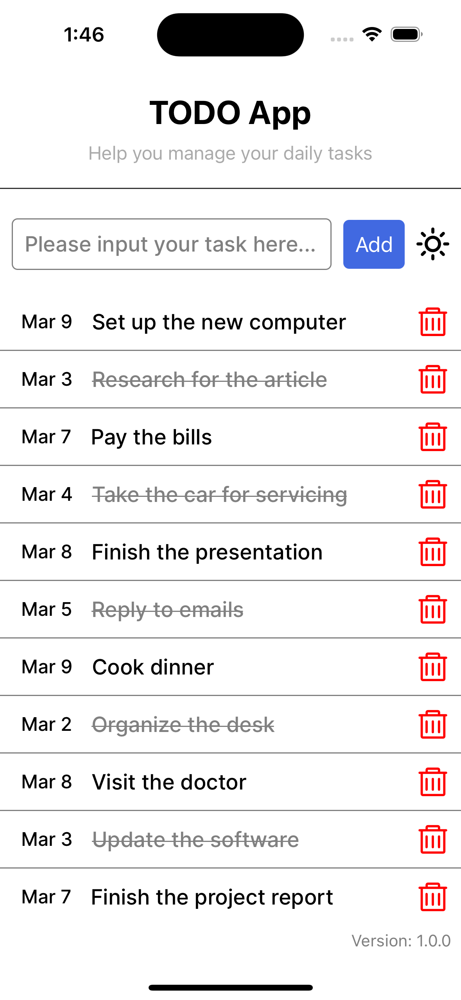
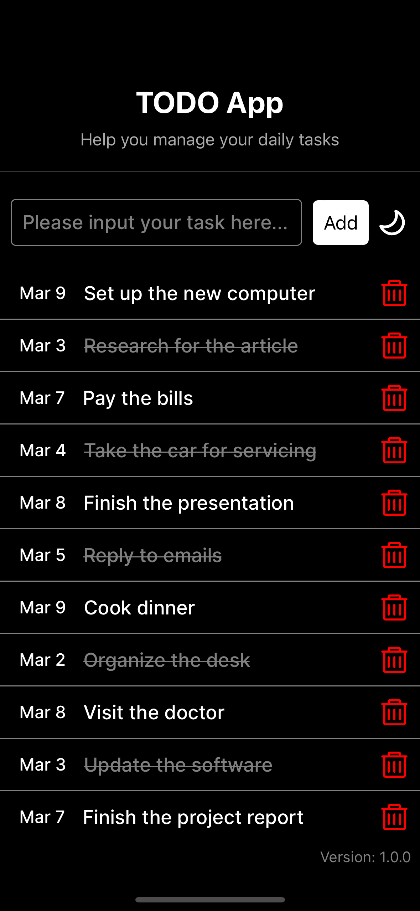

# To-Do App With React Native

## Screenshots

<div align="center" style="display: flex; gap: 20px; justify-content: center;">
  
  
</div>

## Tech Stack

- **React Native**: A framework for building native apps using React.
- **Expo**: A framework and platform for universal React applications.
- **TypeScript**: A typed superset of JavaScript that compiles to plain JavaScript.


## Get started

1. Install dependencies

   ```bash
   npm install
   ```

2. Start the app

   ```bash
   npx expo start
   ```
